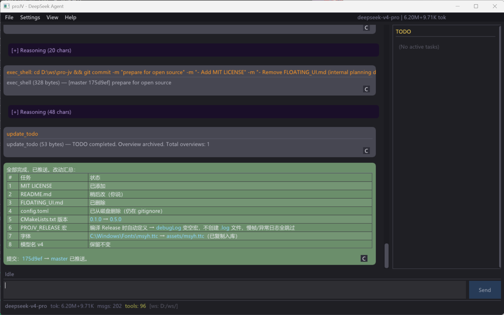

# proJV — Windows DeepSeek GUI Agent

<p align="center">
  <a href="README_zh.md">简体中文</a> | <strong>English</strong>
</p>

<p align="center">
  
</p>

Project JV, stands for **Just Vibing**

A DeepSeek AI Agent built with **Dear ImGui + DirectX11 + libcurl**, C++20.

A **vibe coding** project — from the first line of code to every feature, entirely written by AI Agent. I just filed requests and clicked Approve.

---

## Why

I'm an algorithm engineer. Primary language C++, also Python for training neural nets. I like my PC to play games, and I like lightweight libraries.

This background never made the existing TUI tools or "big-co AI Agents" click for me — I wasn't sure those flashy plugins, beautiful terminals, and mysterious features would actually help me get work done. Even VS Code, I only install a handful of extensions.

For me, building a lightweight Windows Agent with a simple UI just felt like the natural thing to do.

Keep-it-simple principle, built in spare time. This is not a rigorous project, far from production quality. But luckily it has crossed the **self-iteration** threshold — proJV can now read its own code, modify itself, compile, and debug. It rarely crashes anymore. I'm genuinely curious what it will grow into.

Hope you like it too.

---

## Features

| Feature | Description |
|---------|-------------|
| **AI tool orchestration** | read_file, write_file, edit_file, shell, file_search, git, web_search, fetch_url, todo — AI decides what to call and when |
| **Custom system prompt** | Editable system prompt to define Agent behavior, tool whitelist, and output style |
| **Thinking display** | deepseek-reasoner `reasoning_content` rendered as collapsible purple cards |
| **Streaming output** | Real-time SSE streaming with Markdown + code block rendering |
| **Context management** | Token estimation + smart pruning, auto-compact at high pressure |
| **Session persistence** | SQLite auto-save, supports new/save/load conversation history |
| **Status bar** | Live model name, token counts (in+out), message count, tool calls, context pressure % |
| **Tool approval** | Destructive operations require user confirmation before execution |
| **TODO management** | AI creates, tracks, and marks tasks; sidebar panel shows real-time status |
| **Theme** | Dark / GitHub Dark |

---

## Quick Start

### Build

Requires CMake and Visual Studio 2019+ (or any C++20-capable compiler).

```bash
# Open x64 Native Tools Command Prompt, then:
cd proJV
mkdir build && cd build
cmake .. -G Ninja -DCMAKE_CXX_COMPILER=cl -DCMAKE_BUILD_TYPE=Release
cmake --build .
```

A `clean_and_build.bat` is also provided — feel free to ask your AI Agent to adapt it.

Artifact: `build/proJV.exe` (~3MB, depends on Windows system DLLs + VC runtime)

### Run

1. Get a DeepSeek API Key: [platform.deepseek.com](https://platform.deepseek.com/api_keys)
2. Double-click `proJV.exe`, enter Key → **Save & Connect**
3. Start chatting

The API key is saved to `config.toml` next to the executable, auto-loaded on restart.

---

## Architecture

```
proJV/
├── CMakeLists.txt
├─┬ assets/
│ └── msyh.ttc              # Microsoft YaHei font (CJK support)
├── external/                # Static dependencies, no package manager
│   ├── imgui/               # Dear ImGui GUI framework
│   ├── imgui_markdown.h     # Markdown rendering
│   ├── json.hpp             # JSON parser (nlohmann)
│   ├── toml.hpp             # TOML parser (toml++)
│   ├── SQLiteCpp-3.3.3/     # SQLite C++ wrapper
│   ├── curl-8.21.0/         # libcurl (HTTP/HTTPS)
│   └── loguru.cpp/hpp       # Logging
├─┬ src/
│ ├── main.cpp               # WinMain + D3D11 + ImGui main loop
│ ├── debug_log.h            # Log macros (silent in Release builds)
│ ├─┬ client/                # DeepSeek API client
│ │ └── deepseek.h/.cpp      # libcurl HTTP + SSE streaming
│ ├─┬ core/                  # Core logic
│ │ ├── agent.h/.cpp         # Agent loop (think → tool → reply)
│ │ ├── session.h/.cpp       # Session management + token estimation
│ │ ├── config.h/.cpp        # TOML config loader
│ │ ├── storage.h/.cpp       # SQLite persistence
│ │ ├── storage_queue.h/.cpp # Async write queue
│ │ ├── tool_worker.h/.cpp   # Background tool execution
│ │ └── prompts_loader.cpp   # System prompt loading
│ ├─┬ ui/                    # User interface
│ │ ├── app.h/.cpp           # Main app + window management
│ │ ├── render_chat.cpp      # Chat bubbles + Markdown rendering
│ │ └── render_settings.cpp  # Settings panel
│ └─┬ tools/                 # Agent-callable tools
│   ├── registry.h/.cpp      # Tool registry
│   ├── shell_tool.cpp       # Shell command execution
│   ├── file_tool.cpp        # File read/write
│   ├── edit_file_tool.cpp   # Search-replace edit
│   ├── file_search_tool.cpp # File search
│   ├── web_tools.cpp        # Web search + fetch
│   └── todo_tool.cpp        # TODO management
└── build/
    └── proJV.exe            # Built artifact (~3MB)
```

### Data flow

```
User input → Agent (think/reason)
                ↓
        Need tool? → ToolWorker (background thread)
                ↓
        Generate reply → libcurl SSE stream → UI bubble render
                ↓
        SQLite async write (persistence)
```

---

## Dependencies

| Library | Purpose | Source |
|---------|---------|--------|
| [Dear ImGui](https://github.com/ocornut/imgui) | GUI framework | `external/imgui/` |
| [imgui_markdown](https://github.com/juliettef/imgui_markdown) | Markdown rendering | Single header |
| [SQLiteCpp](https://github.com/SRombauts/SQLiteCpp) | Database | `external/SQLiteCpp-3.3.3/` |
| [libcurl](https://curl.se/) | HTTP/HTTPS | `external/curl-8.21.0/` |
| [loguru](https://github.com/emilk/loguru) | Logging | `external/loguru.cpp` |
| [nlohmann/json](https://github.com/nlohmann/json) | JSON parsing | Single header |
| [toml++](https://github.com/marzer/tomlplusplus) | TOML parsing | Single header |
| DirectX 11 | GPU rendering | System built-in |

**No vcpkg / conan / npm / pip.** All dependencies are source-level; one `cmake --build` does it all.

---

## Credits

- [DeepSeek](https://deepseek.com) — API and reasoning engine
- [Dear ImGui](https://github.com/ocornut/imgui) — Best immediate-mode GUI
- [SQLiteCpp](https://github.com/SRombauts/SQLiteCpp) — Lightweight DB wrapper
- [libcurl](https://curl.se/) — Reliable HTTP client
- [loguru](https://github.com/emilk/loguru) — Clean C++ logging
- [imgui_markdown](https://github.com/juliettef/imgui_markdown) — Markdown rendering
- All other open-source maintainers

---

## Buy me a coffee

If proJV saves you time or brings you joy — I'd appreciate a coffee ☕
*(China / WeChat only)*

<p align="left">
  
</p>
