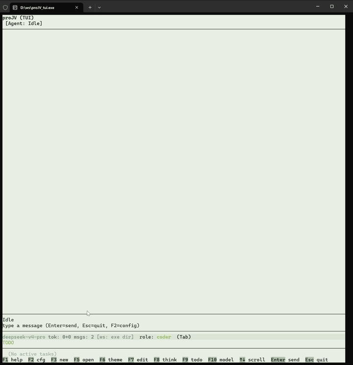

# proJV -- 原生 C++ 终端 AI Agent（TUI）

<p align="center">
  <strong>简体中文</strong> | <a href="README.md">English</a>
</p>

**proJV = Project Just Vibing** -- 一个快速、精致的原生 C++ 终端 AI Agent，基于 DeepSeek API。

基于 **FTXUI + libcurl**，C++20 实现。**零包管理器依赖**，一条 `cmake --build`，产出约 3 MB 的二进制文件。

> proJV 的每一行代码，都是 proJV 自己写的。

<p align="center">
  
</p>

---

## 为什么是 proJV

### 1. AI Native Embedded System -- C++ & TUI

AI Native Embedded System 是未来 Agent 一大方向。原生 C++ 与终端优先的界面带来几大优势：

- **硬件控制的可扩展性** -- C++ 可以直接调用系统 API、操作 GPIO 和外设，不需要经过中间层。
- **C++ 部署轻量** -- 二进制体积小、无运行时依赖；复杂的 AI 能力可以通过 pytool 调用 Python。
- **终端界面随处可跑** -- SSH、tmux、无头机器、Windows Terminal 都能用，不依赖 GPU 或窗口系统。
- **嵌入式场景对 CPU 开销敏感** -- 过多的解释型语言会占用计算资源。

proJV 为这个方向而生。

### 2. No-MCP

我相信你可以自己实现任何 MCP 功能。

### 3. 目前只用 DeepSeek

真的太便宜了。

| 模型 | 输入 | 输出 |
|------|------|------|
| deepseek-v4-flash | ¥1 / 1M tokens | ¥2 / 1M tokens |
| deepseek-v4-pro   | ¥3 / 1M tokens | ¥6 / 1M tokens |

---

## 核心功能

### 1. 多角色 System Prompt

往 `projv_files/prompts/` 丢一个 `.md` 文件，立刻成为可选角色。对话中按 **Tab** 切换角色、不丢上下文。内置三个预设：

| 角色 | 说明 |
|------|------|
| **coder**（默认） | 全 11 工具访问 -- 读写、编辑、Shell、搜索、Web、架构图、TODO |
| **designer** | 只读分析模式 -- 锁定 Shell 和源码编辑，通过 `md_file` 产出结构化设计文档 |
| **analyzer** | 代码分析 + `diagram_tool` 架构图支持 |

### 2. 全流程自定义 -- 每一层都是你的

| 层级 | 自定义方式 |
|------|-----------|
| **System Prompt** | 丢 `.md` 到 `projv_files/prompts/`，立刻成为可选角色 |
| **Compactor** | 控制上下文达到压力阈值时的压缩策略，可以自己写 |
| **Python 工具 (pytool)** | 在 `projv_files/pytool/` 里放自己的 Python 脚本，Agent 自动发现并调用 |
| **主题** | 可视化编辑器实时预览，8 套预设，JSON 导入/导出，每个颜色都可调 |
| **配置** | 全部在 `config.toml` 里 -- 模型、Key、UI 偏好。纯文本，无隐藏状态 |

没有封闭的"生态锁死"。**每个旋钮你都能拧。**

### 3. Python 工具自主扩展（pytool）

往 `projv_files/pytool/` 丢一个 Python 工具文件夹，Agent 自动发现。每个工具只需要两个文件：

```
projv_files/pytool/
└── my_tool/
    ├── tool.json    # 工具名、描述、参数
    └── main.py      # 从 stdin 读 JSON，结果打印到 stdout
```

**极简示例** -- 获取当前时间：

`tool.json`：
```json
{
    "name": "get_time",
    "description": "获取当前系统时间。",
    "parameters": []
}
```

`main.py`：
```python
import json, sys, time
args = json.loads(sys.stdin.read())
print(time.strftime("%Y-%m-%d %H:%M:%S"))
```

**就这么简单。** Agent 读取 `tool.json` 学会调用参数，通过 stdin 传入 JSON 执行 `main.py`，stdout 即为结果。需要 pip 依赖时加一个 `requirements.txt`。

### 4. TODO -- 做完自动总结

AI 在 TODO 面板实时管理任务清单。任务完成后不只是打个勾 -- **它会写一个结构化总结**：改了哪些文件、做了什么、编译验证结果。再也不用问"Agent 刚刚到底干了啥"。

### 5. 主题系统

两套内置（Obsidian / Light），外加 6 套精选主题可由 `projv_files/theme/` 安装。可视化面板逐色编辑，实时预览，支持 JSON 导入/导出。选择自动保存到 `projv_files/config.toml`，下次启动即恢复。

---

## 功能总览

| 功能 | 说明 |
|------|------|
| **AI 自动调用工具** | read_file, write_file, edit_file, md_file, exec_shell, grep_files, file_search, web_search, fetch_url, update_todo, diagram_tool -- AI 自主决策 |
| **思考过程展示** | deepseek-reasoner 推理链默认折叠为一行摘要，展开显示尾部窗口（F8） |
| **流式 Markdown** | 实时 SSE + 自研渲染器（代码块、表格、链接、标题） |
| **CJK 软换行** | 聊天气泡与输入框超宽自动折行，缩放时重新折行 |
| **安全退出** | 窗口关闭 / Ctrl+C 时正确 checkpoint 并关闭 SQLite |
| **上下文管理** | Token 估算 + 智能压缩，达到压力阈值自动缩容 |
| **会话持久化** | SQLite 自动保存，可从会话选单打开历史 |
| **实时状态栏** | 模型、角色、Token 用量、成本估算、上下文压力 % |
| **工具审批** | 破坏性操作确认后放行 |

---

## 快捷键

| 按键 | 功能 |
|------|------|
| `F1` | 关于 |
| `F2` | 配置 |
| `F3` | 新建对话 |
| `F5` | 打开会话（从 `projv_files/sessions/` 选单） |
| `F6` | 切换主题 |
| `F7` | 主题编辑器 |
| `F8` | 折叠/展开思考（摘要 ↔ 尾部窗口） |
| `F9` | 折叠/展开 TODO 面板 |
| `F10` | 切换模型（从 API 拉取列表） |
| `Tab` | 切换角色 |
| `↑` / `↓` | 逐行滚动聊天 |
| `PgUp` / `PgDn` | 翻页滚动聊天 |
| `Enter` | 发送消息 |
| `Esc` | 忙时取消本轮 / 空闲时退出 |

快捷命令：`/help`、`/workspace`、`/clear`、`/compress`。

---

## 快速开始

### 构建

#### Windows

需要 CMake 和 Visual Studio 2019+（或任何支持 C++20 的编译器）。

```bash
# 打开 x64 Native Tools 命令行，然后：
cd proJV
mkdir build && cd build
cmake .. -G Ninja -DCMAKE_CXX_COMPILER=cl -DCMAKE_BUILD_TYPE=Release
cmake --build .
```

> 注意：如果 Windows Defender 误删 `proJV_tui.exe`（无签名二进制），把 build 目录加入排除项：
> `Add-MpPreference -ExclusionPath "D:\ws\proJV\build"`（管理员 PowerShell）。

#### Linux

```bash
cd proJV
mkdir build_linux && cd build_linux
cmake .. -DCMAKE_BUILD_TYPE=Release
make -j$(nproc)
```

产物：`proJV_tui`（约 3 MB，双平台同名）。

### 运行

1. 申请 DeepSeek API Key：[platform.deepseek.com](https://platform.deepseek.com/api_keys)
2. 在终端启动 `proJV_tui`（推荐 Windows Terminal），输入 Key -> **Save & Connect**
3. 开始对话 -- 往 `projv_files/prompts/` 丢自定义 prompt，往 `projv_files/theme/` 丢主题，往 `projv_files/pytool/` 丢 Python 工具

---

## 架构

```
proJV/
├── CMakeLists.txt
├── projv_files/               # 运行时数据目录
│   ├── config.toml            # 配置文件（首次保存时自动创建）
│   ├── prompts/               # System Prompt .md 文件
│   ├── theme/                 # 可安装的主题 JSON
│   ├── pytool/                # Python 工具（diagram_tool 等）
│   └── sessions/              # SQLite 会话数据库
├── external/                  # 静态依赖：FTXUI, SQLiteCpp, libcurl, json.hpp, toml.hpp, loguru
├── src/
│   ├── tui/main_tui.cpp       # 入口 + FTXUI 事件循环
│   ├── tui/                   # App、聊天视图、Markdown、配置、主题、状态栏、TODO
│   ├── client/deepseek.*      # DeepSeek API（libcurl + SSE）
│   ├── core/                  # Agent, Session, Config, Storage, Prompts
│   ├── platform/              # Windows/Linux 进程与系统抽象
│   └── tools/                 # Shell、file、search、web、md_file、todo、pytool
└── tests/                     # doctest 单元 + FTXUI golden 测试
```

---

## 依赖

| 库 | 用途 | 来源 |
|----|------|------|
| [FTXUI](https://github.com/ArthurSonzogni/FTXUI) | 终端 UI 框架 | `external/FTXUI-7.0.3/` |
| [SQLiteCpp](https://github.com/SRombauts/SQLiteCpp) | 数据库 | `external/SQLiteCpp-3.3.3/` |
| [libcurl](https://curl.se/) | HTTP/HTTPS | `external/curl-8.21.0/`（Win）/ 系统（Linux） |
| [loguru](https://github.com/emilk/loguru) | 日志 | `external/loguru.cpp` |
| [nlohmann/json](https://github.com/nlohmann/json) | JSON 解析 | 单头文件 |
| [toml++](https://github.com/marzer/tomlplusplus) | TOML 解析 | 单头文件 |

**没有 vcpkg / conan / npm / pip。** 所有依赖要么内嵌，要么走系统库。

---

## 致谢

- [DeepSeek](https://deepseek.com)
- [FTXUI](https://github.com/ArthurSonzogni/FTXUI)
- [SQLiteCpp](https://github.com/SRombauts/SQLiteCpp)
- [libcurl](https://curl.se/)
- [loguru](https://github.com/emilk/loguru)
- 所有开源依赖的维护者

---

## 请我喝咖啡

如果 proJV 为你节省了时间或带来了乐趣，欢迎请我喝杯咖啡
*（仅支持中国大陆 / 微信赞赏）*

<p align="left">
  
</p>
