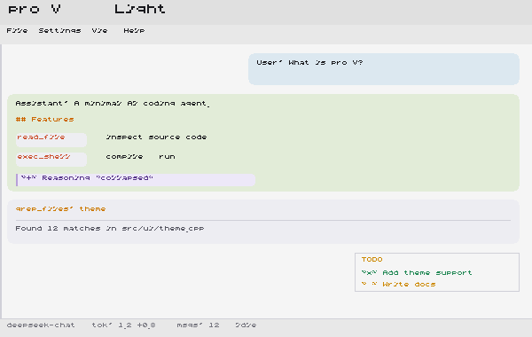
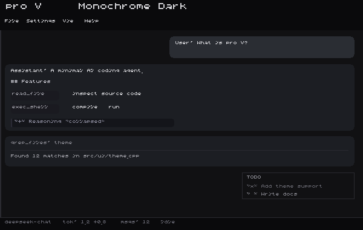
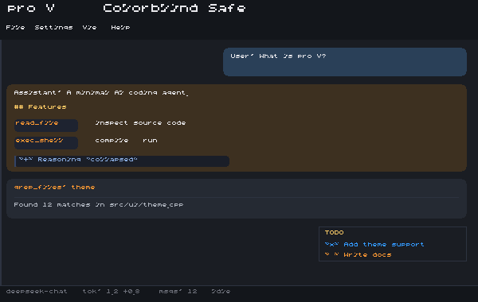
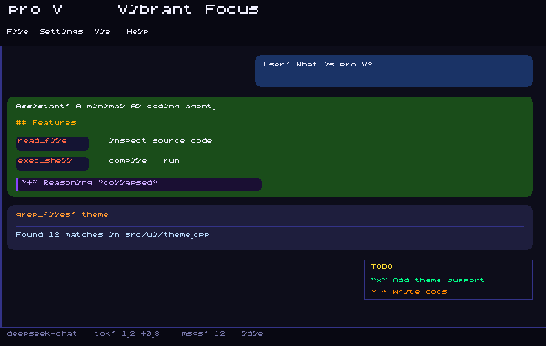
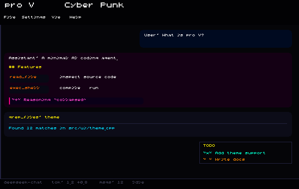
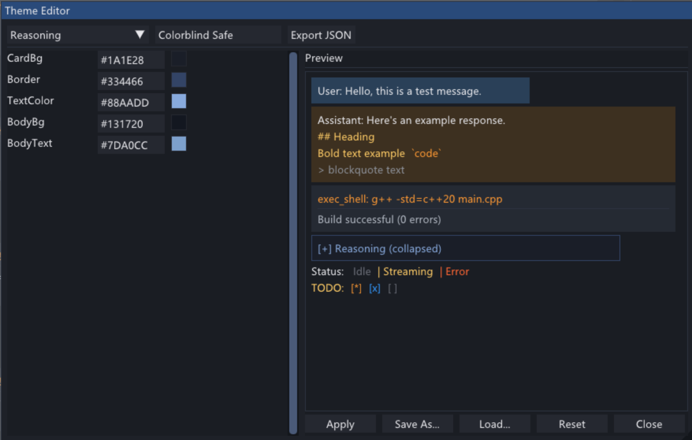

# proJV -- Windows DeepSeek GUI Agent

<p align="center">
  <strong>简体中文</strong> | <a href="README.md">English</a>
</p>

<p align="center">
  
</p>

Project JV, 意思是 **Just Vibing** -- 一个轻快、精致的 Windows 桌面 AI Agent，基于 DeepSeek API，全部代码由 AI 自主生成。

基于 **Dear ImGui + DirectX11 + libcurl**，C++20 实现。**零包管理器依赖**，一条 `cmake --build` 搞定。

> 这个项目的每一行代码，都是 AI Agent 写的。我只负责提需求和点 Approve。

---

## 为什么有它

图像算法工程师，主力 C++，也拿 Python 训 NN。喜欢 PC 能打游戏，喜欢轻量的三方库。

市面上的 AI 编程工具太臃肿了 -- 花花绿绿的插件、复杂的终端、永远用不到的功能。我想要的是一个**原生 Windows 桌面应用**：快、干净、真正能帮我干活。

proJV 就是这个工具。它能读懂你的代码库、执行 Shell 命令、编辑文件、搜索网页、管理 TODO -- 全在清爽的 GUI 里完成。它甚至能**修改和编译自己**。

---

## 亮点功能

### 多角色 System Prompt

往 `projv_files/prompts/` 丢一个 `.md` 文件，立刻出现在角色选择器里。内置 **coder**（全 11 工具，默认）、**designer**（只读分析模式 -- 锁定 Shell 和源码编辑，通过 `md_file` 产出结构化设计文档）和 **analyzer**（代码分析 + `diagram_tool` 架构图）。切换角色不丢上下文。

<p align="center">
  
</p>

### 主题系统

两套内置（Obsidian / Light），外加 6 套精选主题可由 `projv_files/theme/` 安装。可视化面板逐色编辑，实时预览，支持 JSON 导入/导出。选择自动保存到 `projv_files/config.toml`，下次启动即恢复。

| 预览 | 主题 | 风格 |
|------|------|------|
|  | **Obsidian** | 精炼暖紫黑（默认） |
|  | **Light** | 干净白色（默认） |
|  | **Forest** | 轻盈森系绿，自然风格 |
|  | **Artism** | 暖调焦糖，咖啡馆文艺感 |
|  | **Monochrome Dark** | 全灰度极简，零色彩干扰 |
|  | **Colorblind Safe** | 蓝橙调色板，覆盖常见色觉障碍类型 |
|  | **Vibrant Focus** | 高饱和霓虹，强视觉分区 |
|  | **Cyber Punk** | 霓虹黄粉青 + 纯黑底，赛博朋克 2077 风格 |

<p align="center">
  
  <br/><sub>内置可视化编辑器 -- 按分类逐色调整，实时预览效果，支持 JSON 导出/导入</sub>
</p>

---

## 支持功能

| 功能 | 说明 |
|------|------|
| **AI 自动调用工具** | read_file, write_file, edit_file, md_file, exec_shell, grep_files, file_search, web_search, fetch_url, update_todo, diagram_tool -- AI 自主决策 |
| **思考过程展示** | deepseek-reasoner 推理链可折叠卡片 |
| **流式 Markdown** | 实时 SSE + 自研渲染器（代码块、表格、链接、标题） |
| **上下文管理** | Token 估算 + 智能压缩，达到压力阈值自动缩容 |
| **会话持久化** | SQLite 自动保存，支持新建/保存/加载历史会话 |
| **实时状态栏** | 模型名、Token 用量（输入+输出）、消息数、工具调用、上下文压力 % |
| **工具审批** | 破坏性操作弹窗确认后放行 |
| **TODO 面板** | AI 自主管理任务清单，侧边栏实时可见 |

---

## 快速开始

### 构建

需要 CMake 和 Visual Studio 2019+（或任何支持 C++20 的编译器）。

```bash
call "C:\Program Files (x86)\Microsoft Visual Studio\2019\Community\VC\Auxiliary\Build\vcvars64.bat"

cd proJV
mkdir build && cd build
cmake .. -G Ninja -DCMAKE_CXX_COMPILER=cl -DCMAKE_BUILD_TYPE=Release
cmake --build .
```

项目根目录附带了 `clean_and_build.bat`。

产物：`build/proJV.exe`（~3 MB）

### 运行

1. 申请 DeepSeek API Key：[platform.deepseek.com](https://platform.deepseek.com/api_keys)
2. 双击 `proJV.exe`，输入 Key -> **Save & Connect**
3. 开始对话 -- 也可以往 `projv_files/prompts/` 丢自定义 prompt，往 `projv_files/theme/` 丢主题文件

---

## 架构

```
proJV/
├── CMakeLists.txt
├── assets/                    # 字体、截图、主题预览图
├── projv_files/               # 运行时数据目录
│   ├── config.toml            # 配置文件（首次保存时自动创建）
│   ├── prompts/               # System Prompt .md 文件
│   ├── theme/                 # 可安装的主题 JSON
│   ├── pytool/                # Python 工具（diagram_tool 等）
│   └── sessions/              # SQLite 会话数据库
├── external/                  # 静态依赖：imgui, json.hpp, toml.hpp, SQLiteCpp, libcurl, loguru
├── src/
│   ├── main.cpp               # WinMain + D3D11 + ImGui 主循环
│   ├── client/deepseek.*      # DeepSeek API（libcurl + SSE）
│   ├── core/                  # Agent, Session, Config, Storage, Prompts
│   ├── ui/                    # App, Chat, Settings, Markdown, Theme 系统
│   └── tools/                 # Shell, file, search, web, md_file, todo
└── build/
    └── proJV.exe              # ~3 MB
```

---

## 依赖

| 库 | 用途 | 来源 |
|----|------|------|
| [Dear ImGui](https://github.com/ocornut/imgui) | GUI 框架 | `external/imgui/` |
| [SQLiteCpp](https://github.com/SRombauts/SQLiteCpp) | 数据库 | `external/SQLiteCpp-3.3.3/` |
| [libcurl](https://curl.se/) | HTTP/HTTPS | `external/curl-8.21.0/` |
| [loguru](https://github.com/emilk/loguru) | 日志 | `external/loguru.cpp` |
| [nlohmann/json](https://github.com/nlohmann/json) | JSON 解析 | 单头文件 |
| [toml++](https://github.com/marzer/tomlplusplus) | TOML 解析 | 单头文件 |
| DirectX 11 | GPU 渲染 | 系统内置 |

**没有 vcpkg / conan / npm / pip。**

---

## 致谢

- [DeepSeek](https://deepseek.com)
- [Dear ImGui](https://github.com/ocornut/imgui)
- [SQLiteCpp](https://github.com/SRombauts/SQLiteCpp)
- [libcurl](https://curl.se/)
- [loguru](https://github.com/emilk/loguru)
- 所有开源依赖的维护者

---

## 请我喝咖啡

如果 proJV 为你节省了时间或带来了乐趣，欢迎请我喝杯咖啡
*（仅支持中国大陆 / 微信赞赏）*

<p align="left">
  
</p>
