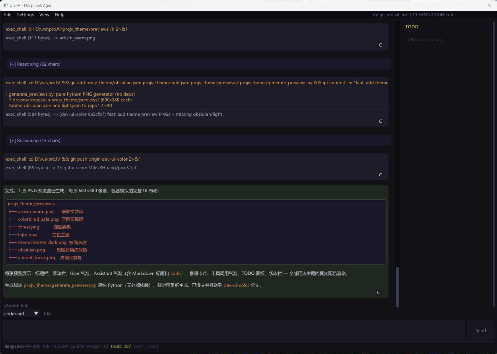
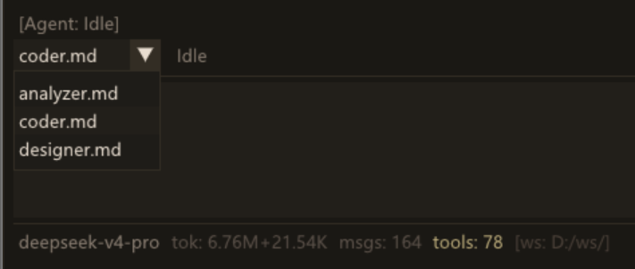
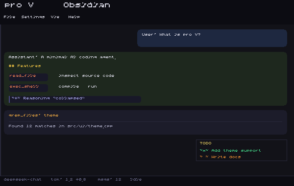
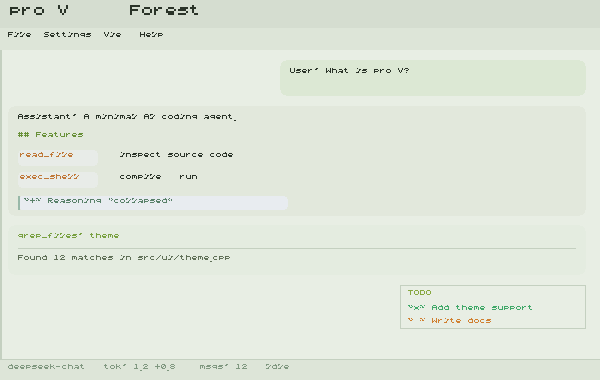
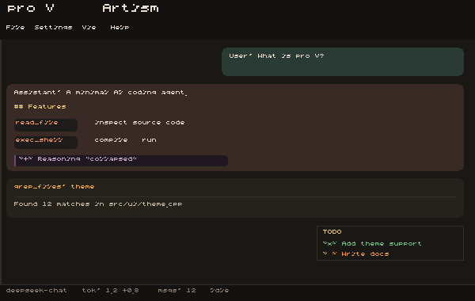

# proJV — Windows DeepSeek GUI Agent

<p align="center">
  <strong>简体中文</strong> | <a href="README.md">English</a>
</p>

<p align="center">
  
</p>

Project JV, 意思是 **Just Vibing** — 一个轻快、精致的 Windows 桌面 AI Agent，基于 DeepSeek API，全部代码由 AI 自主生成。

基于 **Dear ImGui + DirectX11 + libcurl**，C++20 实现。**零包管理器依赖**，一条 `cmake --build` 搞定。

> 这个项目的每一行代码，都是 AI Agent 写的。我只负责提需求和点 Approve。

---

## 为什么有它

图像算法工程师，主力 C++，也拿 Python 训 NN。喜欢 PC 能打游戏，喜欢轻量的三方库。

市面上的 AI 编程工具太臃肿了 — 花花绿绿的插件、复杂的终端、永远用不到的功能。我想要的是一个**原生 Windows 桌面应用**：快、干净、真正能帮我干活。

proJV 就是这个工具。它能读懂你的代码库、执行 Shell 命令、编辑文件、搜索网页、管理 TODO — 全在清爽的 GUI 里完成。它甚至能**修改和编译自己**。

这仍然是个业余项目，但已经跨过了自我迭代的门槛，而且越来越好用。

---

## 亮点功能

### Designer 工作流

锁定破坏性工具，让 AI 先产出结构化设计文档再动手写代码。适合架构评审和大规模重构。

<p align="center">
  
</p>

### 自定义 System Prompt

往 `projv_prompts/` 丢一个 `.md` 文件，立刻出现在角色选择器里。在 coder / designer / 你自己的角色之间随时切换，不丢上下文。

<p align="center">
  
</p>

### 主题系统

7 套精选内置主题 + 完整自定义。菜单一键切换，可视化编辑器逐色微调，JSON 导入/导出，自动保存到 `config.toml`。

<p align="center">
  
  
  
  <br/>
  <sub><b>Obsidian</b> · <b>Forest</b> · <b>Artism</b> — 共 7 套主题</sub>
</p>

---

## 支持功能

| 功能 | 说明 |
|------|------|
| **多角色 Prompt** | ComboBox 一键切换 coder / designer / 自定义角色。目录驱动 — 丢 `.md` 进 `projv_prompts/` 即自动识别。 |
| **Designer 工作流** | 只读代码分析模式：`read_file`/`grep_files` + `md_file` 产出设计文档。Shell 和源码编辑被锁定。 |
| **AI 自动调用工具** | 读文件、写文件、编辑、md_file、Shell、文件搜索、网页搜索/抓取、TODO — AI 自主决策 |
| **主题系统** | 7 套内置主题（Obsidian / Light / Forest / Artism / Monochrome / Colorblind Safe / Vibrant Focus）+ 可视化编辑器 + JSON 导入导出 + config.toml 持久化 |
| **思考过程展示** | deepseek-reasoner `reasoning_content` 可折叠卡片展示 |
| **流式 Markdown** | 实时 SSE 流式渲染，自研 Markdown 渲染器（代码块、表格、链接、标题） |
| **上下文管理** | Token 估算 + 智能压缩，达到压力阈值自动缩容 |
| **会话持久化** | SQLite 自动保存，支持新建/保存/加载历史会话 |
| **实时状态栏** | 模型名、Token 用量（输入+输出）、消息数、工具调用、上下文压力 % |
| **工具审批** | 破坏性操作弹窗确认后放行 |
| **TODO 面板** | AI 自主管理任务清单，侧边栏实时可见 |

---

## 快速开始

### 构建
需要 CMake 和 Visual Studio 2019+（或任何支持 C++20 的编译器）。

```bash
call "C:\Program Files (x86)\Microsoft Visual Studio\2019\Community\VC\Auxiliary\Build\vcvars64.bat"

cd proJV
mkdir build && cd build
cmake .. -G Ninja -DCMAKE_CXX_COMPILER=cl -DCMAKE_BUILD_TYPE=Release
cmake --build .
```

项目根目录附带了 `clean_and_build.bat`，可以直接使用。

产物：`build/proJV.exe`（~3 MB）

### 运行

1. 申请 DeepSeek API Key：[platform.deepseek.com](https://platform.deepseek.com/api_keys)
2. 双击 `proJV.exe`，输入 Key → **Save & Connect**
3. 开始对话 — 也可以往 `projv_prompts/` 丢自定义 prompt，往 `projv_theme/` 丢主题文件

---

## 架构

```
proJV/
├── CMakeLists.txt
├─┬ assets/
│ ├── msyh.ttc                  # 微软雅黑 CJK 字体
│ ├── overview.png
│ ├── customize_system_prompt.png
│ └─┬ themes/                   # 主题预览图
│   ├── obsidian.png
│   ├── forest.png
│   └── ...
├─┬ projv_theme/                # 用户可安装的主题 JSON
│ └── *.json
├── external/                   # 静态依赖，零包管理器
│   ├── imgui/                  # Dear ImGui
│   ├── json.hpp                # nlohmann/json（单头文件）
│   ├── toml.hpp                # toml++（单头文件）
│   ├── SQLiteCpp-3.3.3/        # SQLite C++ 封装
│   ├── curl-8.21.0/            # libcurl
│   └── loguru.cpp/hpp          # 日志
├─┬ src/
│ ├── main.cpp                  # WinMain + D3D11 + ImGui 主循环
│ ├── debug_log.h
│ ├─┬ client/                   # DeepSeek API 客户端
│ │ └── deepseek.h/.cpp         # libcurl HTTP + SSE 流式请求
│ ├─┬ core/                     # 核心逻辑
│ │ ├── agent.h/.cpp            # Agent 主循环（思考→工具→回复）
│ │ ├── session.h/.cpp          # 对话管理 + Token 估算
│ │ ├── config.h/.cpp           # TOML 配置加载
│ │ ├── storage.h/.cpp          # SQLite 持久化
│ │ ├── prompts_loader.cpp      # 目录驱动 prompt 预设
│ │ └── prompts.h
│ ├─┬ ui/                       # 用户界面
│ │ ├── app.h/.cpp              # 主应用 + 窗口管理
│ │ ├── render_chat.cpp         # 聊天气泡 + Markdown + Prompt ComboBox
│ │ ├── render_settings.cpp     # 配置 + 工具审批弹窗
│ │ ├── markdown_render.cpp     # 自研 Markdown 渲染器
│ │ ├── theme.h/.cpp            # ThemeColors + ThemeManager（65 色体系）
│ │ └── theme_popup.cpp         # 主题编辑弹窗 + 实时预览
│ └─┬ tools/                    # Agent 可调用的工具集
│   ├── registry.h/.cpp         # 工具注册中心
│   ├── shell_tool.cpp          # Shell 命令执行
│   ├── file_tool.cpp           # 文件读写/搜索
│   ├── edit_file_tool.cpp      # 搜索替换编辑
│   ├── md_file_tool.cpp        # Markdown 设计文档写入（designer 专用）
│   ├── file_search_tool.cpp    # 文件搜索
│   ├── web_tools.cpp           # 网页搜索 + 抓取
│   └── todo_tool.cpp           # TODO 管理
└── build/
    └── proJV.exe               # 编译产物（~3 MB）
```

---

## 依赖

| 库 | 用途 | 来源 |
|----|------|------|
| [Dear ImGui](https://github.com/ocornut/imgui) | GUI 框架 | `external/imgui/` |
| [SQLiteCpp](https://github.com/SRombauts/SQLiteCpp) | 数据库 | `external/SQLiteCpp-3.3.3/` |
| [libcurl](https://curl.se/) | HTTP/HTTPS | `external/curl-8.21.0/` |
| [loguru](https://github.com/emilk/loguru) | 日志 | `external/loguru.cpp` |
| [nlohmann/json](https://github.com/nlohmann/json) | JSON 解析 | 单头文件 |
| [toml++](https://github.com/marzer/tomlplusplus) | TOML 解析 | 单头文件 |
| DirectX 11 | GPU 渲染 | 系统内置 |

**没有 vcpkg / conan / npm / pip。**

---

## 致谢

- [DeepSeek](https://deepseek.com)
- [Dear ImGui](https://github.com/ocornut/imgui)
- [SQLiteCpp](https://github.com/SRombauts/SQLiteCpp)
- [libcurl](https://curl.se/)
- [loguru](https://github.com/emilk/loguru)
- 所有开源依赖的维护者

---

## 请我喝咖啡

如果 proJV 为你节省了时间或带来了乐趣，欢迎请我喝杯咖啡 ☕
*（仅支持中国大陆 / 微信赞赏）*

<p align="left">
  
</p>
