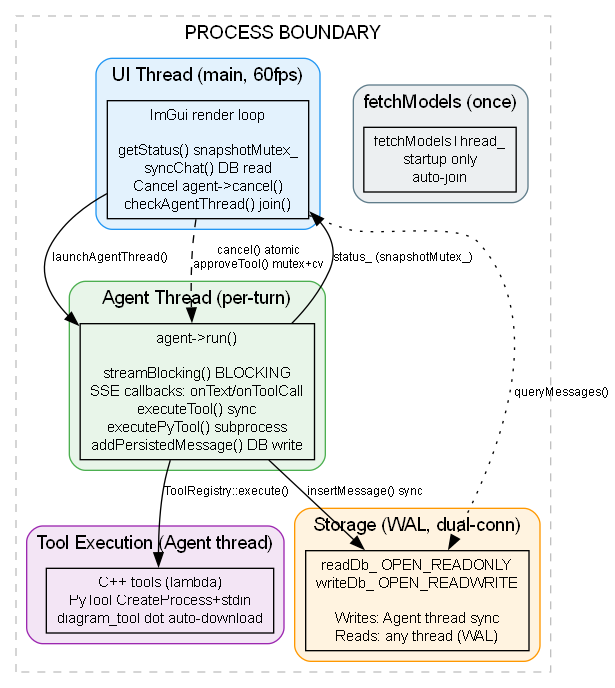
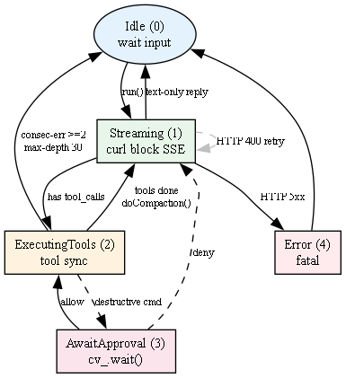
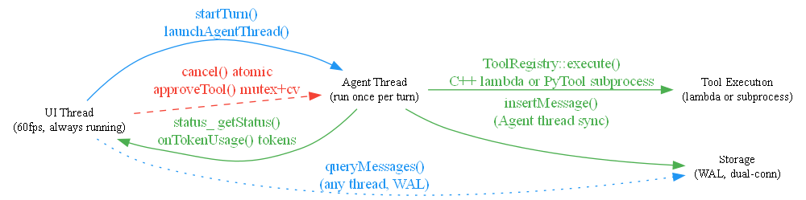

# proJV 线程模型 v2.1

> 最后更新: 2026-07-21
> 变化: Graphviz 渲染图；移除虚构 StorageWriteQueue；新增 PyTool + fetchModels；dot 自动下载

---

## 1. 线程拓扑



**核心认知**：
- 不存在独立的 Streaming Thread — `curl_easy_perform()` 在 Agent Thread 同步阻塞
- 不存在独立的 StorageWriteQueue — DB 写由 Agent 线程同步执行，WAL 双连接保证安全
- PyTool 不创建新线程 — `executePyTool()` 在 Agent 线程同步 `CreateProcess` + `WaitForSingleObject`

### v2.1 变更

| 变更 | 旧版 | 新版 |
|------|------|------|
| StorageWriteQueue | 声称独立线程 | **不存在** — Agent 同步写 DB |
| fetchModelsThread_ | 未提及 | 新增，启动时临时线程 |
| PyTool 执行 | 未提及 | Agent 线程同步子进程 |
| diagram_tool | Graphviz 系统依赖 | dot 自动下载到 tool/bin/ |

---

## 2. Agent 状态机



| 阶段 | 含义 | UI | Agent 线程 |
|------|------|----|-----------|
| Idle (0) | 等待输入 | 输入框可用 | 未运行 |
| Streaming (1) | streamBlocking() 阻塞 | 旋转 + 计数 | curl 阻塞 |
| ExecutingTools (2) | 顺序执行工具 | "tool_name (n/m)" | 同步执行 |
| AwaitApproval (3) | 条件变量等待 | 审批弹窗 | cv_.wait() |
| Error (4) | 不可恢复 | 错误消息 | 退出 |

---

## 3. 线程交汇点



### 交汇点分类

| 交汇点 | 方向 | 同步机制 |
|--------|------|----------|
| status_ 快照 | Agent → UI | snapshotMutex_ |
| Cancel 信号 | UI → Agent | cancelRequested_ (atomic) |
| 审批对话框 | Agent ↔ UI | approvalMutex_ + approvalCv_ |
| DB 写入 | Agent → Storage | Agent 唯一写入者 |
| DB 读取 | UI → Storage | WAL 多读者 |

### 数据所有权

| 数据 | 所属线程 | 读取者 |
|------|----------|--------|
| currentContent_ / currentReasoning_ | Agent | UI 通过 getStatus() 拷贝 |
| chatHistory (deque) | 仅 UI | 仅 UI |
| session.messages | Agent | Agent + UI(DB) |
| todoData | Agent | UI 通过 copyTodoData() (todoMutex_) |
| totalPromptTokens / totalCompletionTokens | Agent | UI 菜单栏 |

---

## 4. 典型场景时序

### 4.1 多工具调用（含 PyTool）

```
UI                      Agent                    curl / API              Tools
|                       |                        |                       |
|                       + Streaming              |                       |
|                       + streamBlocking() ----->| POST + SSE            |
| getStatus() -->lock   |   onText() <-----------| data: ...             |
| (lock free)           |   onToolCall() <-------| tool_calls: [         |
|                       |                        |   read_file,          |
|                       |                        |   diagram_tool,       |
|                       |                        |   md_file             |
|                       |                        | ]                     |
|                       |   onFinish() <---------| data: [DONE]          |
|                       |                        |                       |
|                       + addPersistedMessage    |                       |
|                       | (assistant+3 tool_calls)                       |
|                       |                        |                       |
|                       + ExecutingTools (2)     |                       |
|                       |                        |                       |
| status_.toolProgress  |                        |                       |
| = 1/3 "read_file"     |                        |                       |
| getStatus() -->lock   |                        |                       |
|                       + executeTool(#1) ------>|--------------------->| fs
|                       |   (blocking, Agent thd)|                       |
|                       |   toolResults[0] = <---|<---------------------|
| status_.toolProgress  |                        |                       |
| = 2/3 "diagram_tool"  |                        |                       |
| getStatus() -->lock   |                        |                       |
|                       + executePyTool(#2) ---->|--CreateProcess------>| python
|                       |   (blocking, Agent thd)|  stdin write args    | [BLOCK]
|                       |                        |  stdout read result  | ...
|                       |   toolResults[1] = <---|<---------------------|
| status_.toolProgress  |                        |                       |
| = 3/3 "md_file"       |                        |                       |
| getStatus() -->lock   |                        |                       |
|                       + executeTool(#3) ------>|--------------------->| fs
|                       |   (blocking, Agent thd)|                       |
|                       |   toolResults[2] = <---|<---------------------|
|                       |                        |                       |
|                       + addPersistedMessage x3 (tool results)          |
|                       + doCompaction()         |                       |
|                       + repairSession()        |                       |
|                       + toolCallDepth_++       |                       |
|                       + phase_ = Streaming     |                       |
|                       |                        |                       |
|                       + streamBlocking() ----->| POST (with 3 results)|
| getStatus() -->lock   |   onText() <-----------| data: ...            |
|                       |   onFinish() <---------| data: [DONE]         |
|                       + addPersistedMessage    |                       |
|                       | (assistant reply)      |                       |
|                       + Idle                   |                       |
| getStatus() ->Idle    |   thread exit          |                       |
| syncChat() -->bubble  |                        |                       |
| checkAgentThread()    |                        |                       |
| join() (instant)      |                        |                       |
```

关键：
- **顺序执行**：3 个工具在 Agent 线程按序执行，UI 帧间插入
- **PyTool 无额外线程**：`executePyTool()` 与 C++ 工具相同——Agent 线程同步 `CreateProcess` + `WaitForSingleObject`
- **批量化结果**：所有工具执行完毕后批量 `addPersistedMessage`，然后回退 Streaming
- **toolCallDepth_**：每轮 +1，30 轮上限触发 `softStripLastToolCalls()`

### 4.2 破坏性命令审批

```
UI                      Agent
|                       |
|                       + Streaming -> has tool_calls
|                       + hasDestructiveCommand() -> true
|                       + phase_ = AwaitApproval
|                       + updateSnapshot()
|                       + cv_.wait(approvalDone_)  <-- BLOCKING
|                       |
| getStatus()           |
| -> AwaitingApproval   |
| -> OpenPopup("Delete  |
|    Confirmation")     |
| -> User clicks Allow  |
| -> approveTool(1)     |
| -> approvalDone=true  |
| -> cv_.notify_one() --> wakes up
|                       + ExecutingTools
```

### 4.3 HTTP 400 重试（上下文溢出）

```
UI                      Agent                    curl / API
|                       |                        |
|                       + streamBlocking() ----->| POST -> 400
|                       |   onError("HTTP 400")  |
|                       |   [returns false]      |
|                       + repairSession()        |
|                       + doCompaction()         |  (仅 context-length)
|                       + rebuild request        |
|                       + streamBlocking() ----->| POST -> 200 OK
```

Agent 层 HTTP 4xx 最多 3 次重试；`DeepSeekClient` 对 429+5xx 再重试 3 次。两层作用于不同状态码，无嵌套爆炸。

### 4.4 用户取消

Cancel 传播链：
1. UI 调用 `agent->cancel()`
2. `cancelRequested_.store(true)` (Agent)
3. `client.cancel()` -> `cancelFlag.store(true)` (DeepSeekClient)
4. `approvalDone_ = true; approvalCv_.notify_one()` (唤醒审批等待)
5. `progressCallback` 检查 `cancelFlag` -> 返回 1 -> curl 中止传输
6. Agent 主循环在 5 个位置检查 `cancelRequested_`，跳转到 Idle

---

## 5. Review 结论

| 项目 | 状态 |
|------|:----:|
| 双线程拓扑 (UI + Agent) | ✓ |
| curl_easy_perform() Agent 线程同步阻塞 | ✓ |
| snapshotMutex_ 保护 status_ | ✓ |
| cancel / approveTool atomic + mutex+cv | ✓ |
| AgentPhase 5 状态 | ✓ |
| toolCallDepth_ 30 上限 | ✓ |
| 数据所有权正确 | ✓ |
| PyTool Agent 线程同步子进程 | ✓ |

### 旧版已修正

| 问题 | 修复 |
|------|------|
| StorageWriteQueue 虚构独立线程 | Agent 同步写，WAL 双连接 |
| 未提及 PyTool | 新增同步子进程路径 |
| 未提及 fetchModelsThread_ | 新增启动时临时线程 |
| diagram_tool 外部依赖 | dot.exe 自动下载到 tool/bin/ |
